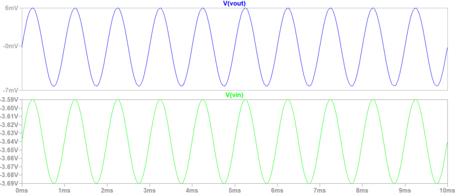
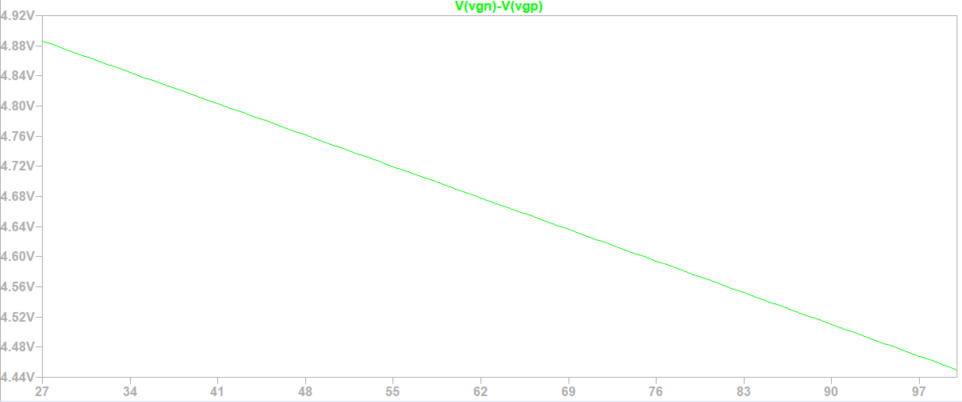
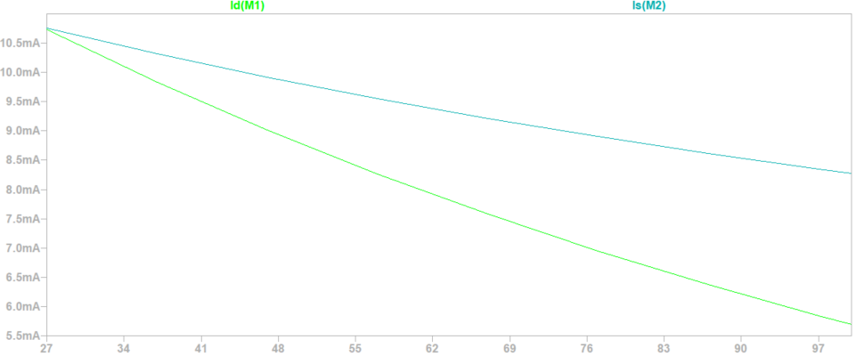

# Class-AB Power Amplifier

The project was developed for an Electronics course at the Aristotle University of Thessaloniki, School of Electrical and Computer Engineering, during the academic year 2023–2024.

For a detailed explanation of the amplifier operation, calculations, and simulation results, see: 
```text
report.pdf
```

## Overview

The amplifier uses a complementary MOSFET output stage biased for Class-AB operation. In this operating mode, the output MOSFETs remain slightly on at rest, which reduces crossover distortion.

The circuit consists of three main stages:

- a biasing network based on the VBE multiplier principle,
- a complementary NPN/PNP Darlington driver stage,
- a complementary common-drain MOSFET output stage.

## Preview






## Simulation Results

The LTspice simulations verify the following:

- DC operating point of the amplifier,
- quiescent current of the MOSFET output stage,
- input-output transient behavior,
- thermal compensation of the bias network.

## Repository Structure

```text
.
├── README.md
├── report.pdf
├── class_ab_power_amplifier.asc
└── images/
    ├── gate_to_gate_bias_voltage_temperature_sweep.png
    ├── quiescent_currents_temperature_sweep.png
    └── input_output_transient_waveforms.png
```

## Files

| File | Description |
| --- | --- |
| `class_ab_power_amplifier.asc` | LTspice schematic file. |
| `report.pdf` | Project report containing the circuit description, calculations, and simulation results. |
| `images/gate_to_gate_bias_voltage_temperature_sweep.png` | Gate-to-gate bias voltage during the temperature sweep. |
| `images/quiescent_currents_temperature_sweep.png` | Quiescent currents of the output MOSFETs during the temperature sweep. |
| `images/input_output_transient_waveforms.png` | Input and output transient waveforms. |
